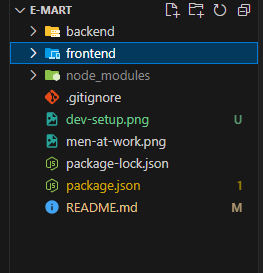
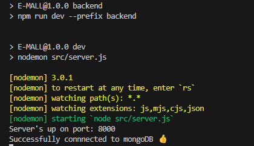
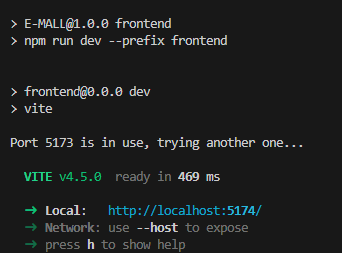

<!-- # E-MART ... -->

<!--  -->

# E-MART DEV - ENVIRONMENT SETUP

## Prerequisites

Ensure you have the following installed:

- [Node.js](https://nodejs.org/) (v14.x or later)
- [npm](https://www.npmjs.com/)
- [Git](https://git-scm.com/)

## Setup Instructions

### Clone the Repository

1. Open your terminal and run the following command to clone the repository:

   ```bash
   git clone https://github.com/benjimwiti/E-MART E-MART
   ```

   you should have a similar folder structure
   
   

### Install dependancies 

1. Navigate to the project directory run the following command to clone the repository:

   ```bash
   cd E-MART
   ```

2. Install the required packages by running the following command:
   
   ```bash
   npm run dev-setup
   ```

   

### Run Development Servers
#### 1. Rest-api setup
- Open a new terminal window in projet's root directory 
- Start the backend development server by running the following command:

```bash
npm run backend
```



#### 2. For the frontend dev server:
-  Open a new terminal window in projet's root directory 
-  Start the frontend development server by running the following command:

```bash
npm run frontend
```



_Click on the blue Link whilst holding CTRL(on windows) or cmd key(on mac) to access the web-app in dev mode_


